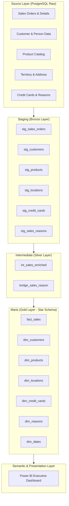
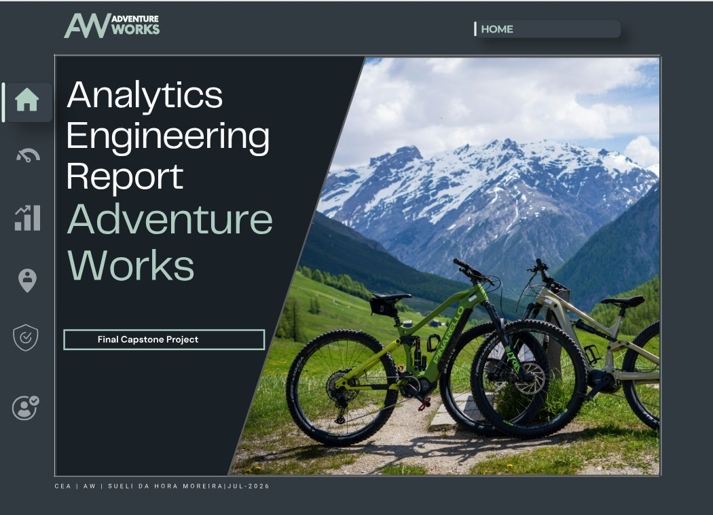
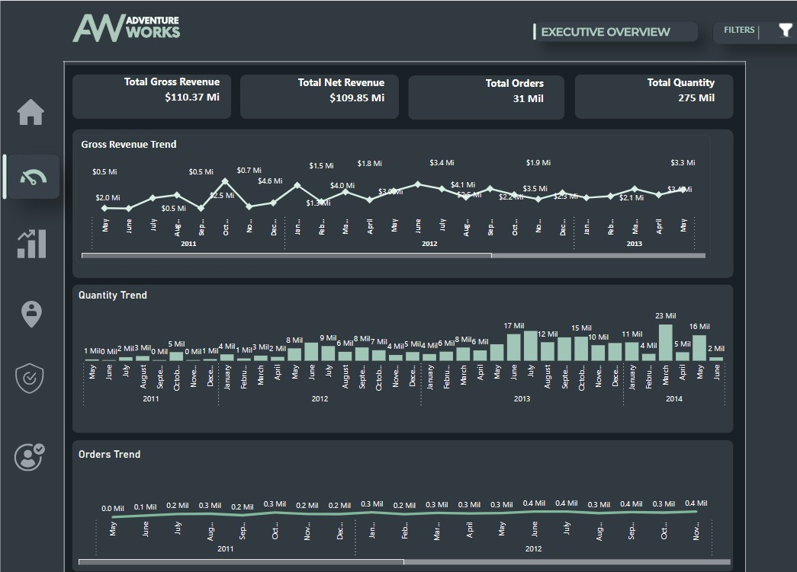
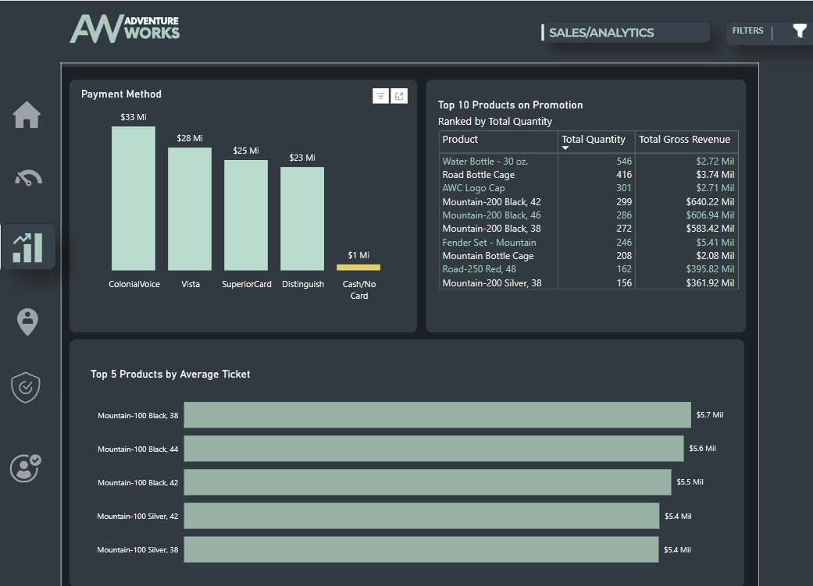
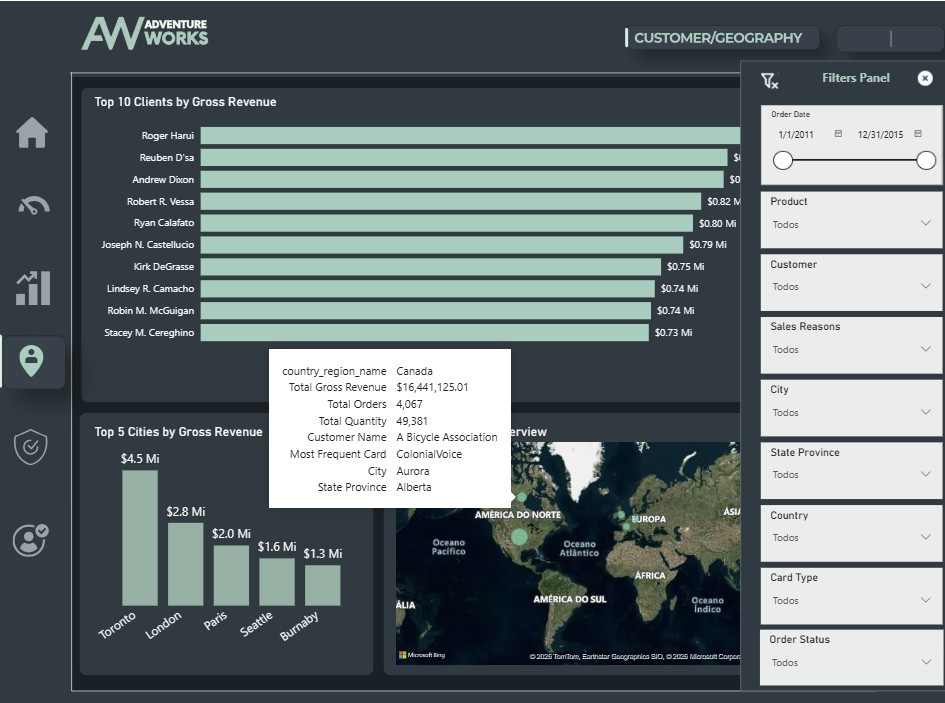
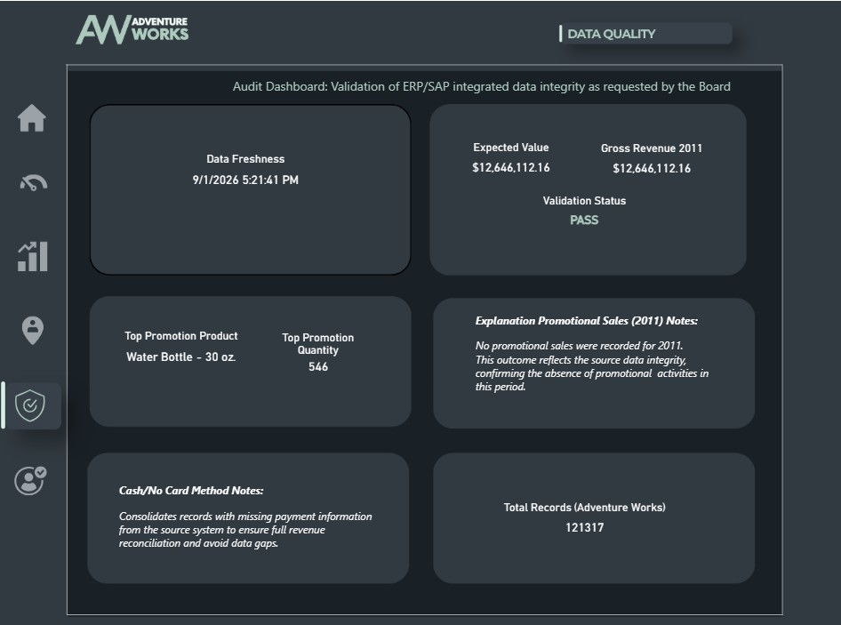
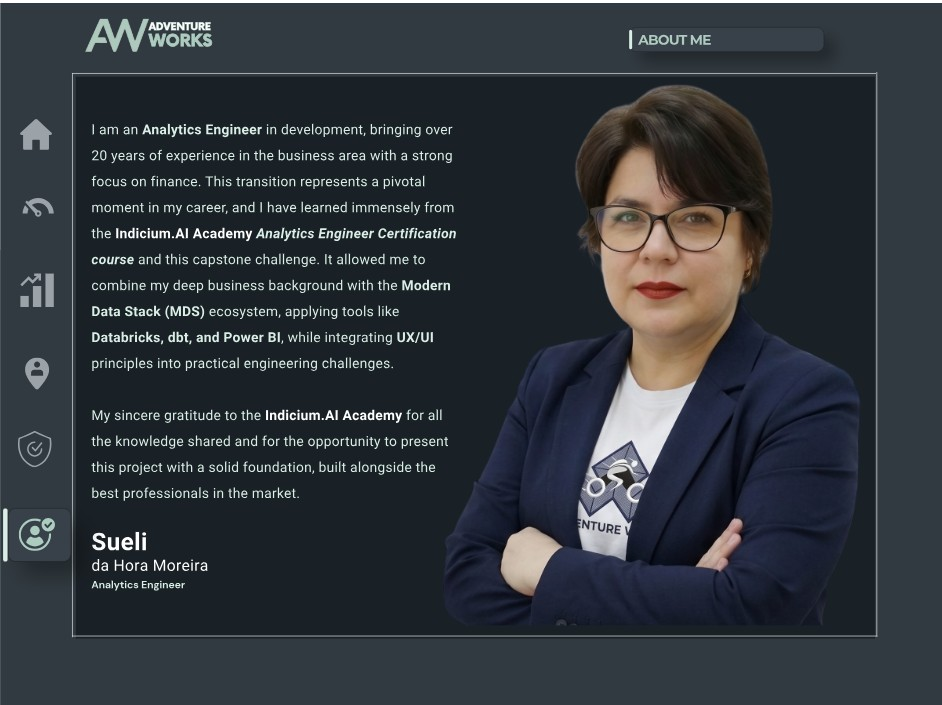

# 🚵 Adventure Works Analytics • Modern Data Stack (MDS)

<p align="center">
  <a href="https://github.com/SueliHora/adventure-works-analytics/actions">
    
  </a>
  
  
  <a href="https://app.powerbi.com/view?r=eyJrIjoiNjA3YzNmZGYtNmM0NC00MzI3LWFmNTItNWUzOTZhODU3OWZlIiwidCI6IjNhZGQxZmM5LWI5NzYtNGQyYy04OTNiLTI4Y2NmMjMwMjEwMyJ9" target="_blank">
    
  </a>
  
  <a href="https://mycourse.app/gCgrzWpkwELkbSkxz" target="_blank">
    
  </a>
</p>

> 📊 **Live Interactive Dashboard:** [Explore the Power BI Report](https://app.powerbi.com/view?r=eyJrIjoiNjA3YzNmZGYtNmM0NC00MzI3LWFmNTItNWUzOTZhODU3OWZlIiwidCI6IjNhZGQxZmM5LWI5NzYtNGQyYy04OTNiLTI4Y2NmMjMwMjEwMyJ9) | 📜 **Official Certification:** [View Verified Credential](https://mycourse.app/gCgrzWpkwELkbSkxz)

## 📌 Executive Summary & Business Context
This repository contains the end-to-end implementation of an enterprise-grade Analytics Engineering pipeline and Data Warehouse for **Adventure Works**, a global bicycle manufacturer and retailer. 

Developed as the **Final Capstone Project for the Analytics Engineering Certification by Indicium AI Academy**, this project bridges transactional ERP/sales data and executive decision-making, providing robust data governance, dimensional modeling, automated testing, and interactive business intelligence.

> 🌐 **Language / Idioma:** [English (Current)](README.md) • [Português (Brasil)](README_pt.md)

---

## 🏛️ Pipeline Architecture & Data Lineage

The architecture follows the **Modern Data Stack (MDS)** paradigm, utilizing **dbt Cloud** for orchestration, transformation, and testing, layered on top of **Databricks**:



---

## 📊 Star Schema Dimensional Modeling

The analytical marts are organized around business processes to enable fast query execution and intuitive self-service BI:

### Fact Table:
- **`fact_sales`**: Line-item grain containing sales volume, unit prices, discounts, gross/net revenue, freight allocation, and order tax.

### Dimension Tables:
- **`dim_customers`**: Unified customer entity joining individual persons and store demographics.
- **`dim_products`**: Normalized product attributes with hierarchical categorization.
- **`dim_locations`**: Geospatial hierarchy (City, State/Province, Country/Region).
- **`dim_credit_cards`**: Payment gateway classification and card type dimensions.
- **`dim_reasons` & `bridge_sales_reason`**: Multi-value bridge modeling for purchase motivators.
- **`dim_dates`**: Complete analytical calendar table for time-intelligence metrics.

---

## 🛡️ Data Quality & Financial Audit Reconciliation

To ensure financial accuracy and compliance with executive audit requirements, automated tests validate data integrity across every build:

- **Board of Directors & CEO Audit Target**: Gross sales for the fiscal year 2011 were mathematically audited and matched the financial target of **$12,646,112.16** (`PASS`).
- **Custom Singular Tests (`tests/`)**:
  - `assert_gross_revenue_2011_target.sql`: Validates historical financial figures against audited statements.
  - `assert_net_revenue_is_positive.sql`: Guarantees no negative net margin anomalies.
  - `assert_positive_order_quantity.sql`: Verifies order quantity validity.
  - `assert_dim_locations_has_valid_city.sql`: Ensures zero null or orphan geographic records.
- **Generic Schema Tests**: Comprehensive `unique`, `not_null`, `relationships`, and `accepted_values` across all surrogate keys and foreign keys.

---

## 📸 Executive Dashboards & Analytics Showcase

| 🏠 Capstone Cover & Overview | 📈 Executive Overview |
| :---: | :---: |
|  |  |
| *Project Overview & Capstone Presentation* | *$110.37M Gross Revenue, Orders & Seasonal Trends* |

| 💳 Sales & Product Analytics | 🌍 Customer & Geography |
| :---: | :---: |
|  |  |
| *Payment Breakdown & Top Promoted Products* | *Global Territory Distribution & Top B2B Clients* |

| 🛡️ Data Quality & Audit Dashboard | 👤 About the Author |
| :---: | :---: |
|  |  |
| *ERP/SAP Integrity Validation & Freshness Audit* | *Analytics Engineering Profile & Modern Data Stack* |

---

## 📂 Repository Structure

```plaintext
adventure-works-analytics/
├── assets/                  # High-resolution dashboard screenshots & evidence
│   ├── dashboard1.jpg
│   ├── dashboard2.jpg
│   ├── dashboard3.jpg
│   ├── dashboard4.jpg
│   ├── dashboard5.jpg
│   └── dashboard6.jpg
├── models/
│   ├── staging/             # Bronze layer: Type casting, renaming & cleaning
│   ├── intermediate/        # Silver layer: Surrogate keys & bridge tables
│   └── marts/               # Gold layer: Star Schema (fact_sales & dimensions)
├── tests/                   # Singular data tests & financial validation logic
│   ├── assert_dim_locations_has_valid_city.sql
│   ├── assert_gross_revenue_2011_target.sql
│   ├── assert_net_revenue_is_positive.sql
│   └── assert_positive_order_quantity.sql
├── macros/                  # Reusable Jinja SQL macros
├── seeds/                   # Static reference datasets
├── dbt_project.yml          # Core dbt configuration
└── README.md                # Technical documentation
```

---

## 🚀 How to Run & Reproduce

```bash
# 1. Clone repository
git clone git@github.com:SueliHora/adventure-works-analytics.git
cd adventure-works-analytics

# 2. Test connection to Databricks
dbt debug

# 3. Build full pipeline (Seeds, Models, Snapshots)
dbt build

# 4. Run automated data quality test suite
dbt test

# 5. Generate and serve interactive dbt documentation
dbt docs generate
dbt docs serve
```

---

## ⚖️ Engineering Decisions & Trade-offs

- **Star Schema vs. One Big Table (OBT):**
  - **Decision:** Implemented a Kimball Star Schema with surrogate keys generated via dbt macros.
  - **Trade-off:** While OBT provides slight query latency gains in some cloud warehouses, the Star Schema guarantees dimensional reusability, reduced storage redundancy, and cleaner self-service modeling for Power BI.

- **Decoupled Transformation (dbt on Databricks):**
  - **Decision:** Used dbt for transformation and version control on top of Databricks compute rather than proprietary ETL GUIs.
  - **Trade-off:** Achieved 100% code-driven data governance, continuous integration testing, and automated lineage tracking.

---

## 👤 Author

**Sueli da Hora Moreira** — *Analytics Engineer*  
Capstone Project for the **Indicium AI Academy Certification**.

---

## 📜 License

This project is licensed under the **MIT License**.