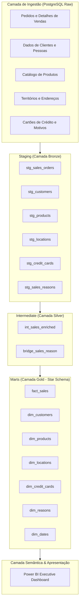

# 🚵 Adventure Works Analytics • Modern Data Stack (MDS)

<p align="center">
  <a href="https://github.com/SueliHora/adventure-works-analytics/actions">
    
  </a>
  
  
  <a href="https://app.powerbi.com/view?r=eyJrIjoiNjA3YzNmZGYtNmM0NC00MzI3LWFmNTItNWUzOTZhODU3OWZlIiwidCI6IjNhZGQxZmM5LWI5NzYtNGQyYy04OTNiLTI4Y2NmMjMwMjEwMyJ9" target="_blank">
    
  </a>
  
  <a href="https://mycourse.app/gCgrzWpkwELkbSkxz" target="_blank">
    
  </a>
</p>

> 📊 **Dashboard Interativo Online:** [Explorar Relatório no Power BI](https://app.powerbi.com/view?r=eyJrIjoiNjA3YzNmZGYtNmM0NC00MzI3LWFmNTItNWUzOTZhODU3OWZlIiwidCI6IjNhZGQxZmM5LWI5NzYtNGQyYy04OTNiLTI4Y2NmMjMwMjEwMyJ9) | 📜 **Certificação Oficial:** [Ver Credencial Verificada](https://mycourse.app/gCgrzWpkwELkbSkxz)

## 📌 Resumo Executivo & Contexto de Negócio
Este repositório contém a implementação ponta a ponta de um pipeline de Engenharia de Analytics e Data Warehouse de padrão corporativo para a **Adventure Works**, uma fabricante e varejista global de bicicletas.

Desenvolvido como o **Projeto Final (Capstone) para a Certificação em Analytics Engineering da Indicium AI Academy**, este projeto conecta dados transacionais de ERP/vendas à tomada de decisão executiva, fornecendo governança de dados robusta, modelagem dimensional, testes automatizados e inteligência de negócios interativa.

> 🌐 **Language / Idioma:** [English](README.md) • [Português (Atual)](README_pt.md)

---

## 🏛️ Arquitetura do Pipeline & Linhagem de Dados

A arquitetura segue o paradigma do **Modern Data Stack (MDS)**, utilizando o **dbt Cloud** para orquestração, transformação e testes, operando sobre o **Databricks**:



---

## 📊 Modelagem Dimensional (Star Schema)

Os marts analíticos foram organizados em torno dos processos de negócio para permitir consultas de alta performance e self-service BI intuitivo:

### Tabela Fato:
- **`fact_sales`**: Granularidade no nível do item do pedido (line-item) contendo volume de vendas, preços unitários, descontos, receita bruta/líquida, rateio de frete e impostos.

### Tabelas Dimensão:
- **`dim_customers`**: Entidade unificada de clientes integrando pessoas físicas e dados demográficos de lojas (B2B).
- **`dim_products`**: Atributos normalizados de produtos com categorização hierárquica.
- **`dim_locations`**: Hierarquia geoespacial (Cidade, Estado/Província, País/Região).
- **`dim_credit_cards`**: Classificação de bandeiras de pagamento e tipos de cartão.
- **`dim_reasons` & `bridge_sales_reason`**: Modelagem em bridge multi-valorada para mapeamento dos motivos de compra.
- **`dim_dates`**: Tabela calendário analítica completa para métricas de inteligência temporal (time-intelligence).

---

## 🛡️ Qualidade de Dados & Reconciliação com Auditoria Financeira

Para garantir acurácia financeira e conformidade com os requisitos de auditoria executiva, testes automatizados validam a integridade dos dados a cada build:

- **Meta de Auditoria da Diretoria & CEO**: As vendas brutas para o ano fiscal de 2011 foram auditadas matematicamente e bateram exatamente a meta financeira de **$12.646.112,16** (`PASS`).
- **Testes Singulares Customizados (`tests/`)**:
  - `assert_gross_revenue_2011_target.sql`: Valida os números financeiros históricos contra relatórios auditados.
  - `assert_net_revenue_is_positive.sql`: Garante a ausência de anomalias de margem líquida negativa.
  - `assert_positive_order_quantity.sql`: Verifica a validade das quantidades dos pedidos.
  - `assert_dim_locations_has_valid_city.sql`: Assegura zero registros geográficos nulos ou órfãos.
- **Testes Genéricos de Schema**: Cobertura abrangente com `unique`, `not_null`, `relationships` e `accepted_values` em todas as chaves substitutas (surrogate keys) e chaves estrangeiras.

---

## 📸 Dashboards Executivos & Vitrine Analítica

| 🏠 Capa do Projeto & Visão Geral | 📈 Visão Executiva |
| :---: | :---: |
|  |  |
| *Visão Geral do Projeto & Apresentação Capstone* | *$110,37M Receita Bruta, Pedidos & Tendências Sazonais* |

| 💳 Análise de Vendas & Produtos | 🌍 Clientes & Geografia |
| :---: | :---: |
|  |  |
| *Detalhamento de Pagamentos & Top Produtos em Promoção* | *Distribuição Territorial Global & Principais Clientes B2B* |

| 🛡️ Qualidade de Dados & Auditoria | 👤 Sobre a Autora |
| :---: | :---: |
|  |  |
| *Validação de Integridade ERP/SAP & Auditoria de Atualização* | *Perfil de Analytics Engineering & Modern Data Stack* |

---

## 📂 Estrutura do Repositório

```plaintext
adventure-works-analytics/
├── assets/                  # Capturas de tela em alta resolução & evidências
│   ├── dashboard1.jpg
│   ├── dashboard2.jpg
│   ├── dashboard3.jpg
│   ├── dashboard4.jpg
│   ├── dashboard5.jpg
│   └── dashboard6.jpg
├── models/
│   ├── staging/             # Camada Bronze: Conversão de tipos, renomeação & limpeza
│   ├── intermediate/        # Camada Silver: Chaves substitutas (SK) & tabelas bridge
│   └── marts/               # Camada Gold: Star Schema (fact_sales & dimensões)
├── tests/                   # Testes de dados singulares & validações financeiras
│   ├── assert_dim_locations_has_valid_city.sql
│   ├── assert_gross_revenue_2011_target.sql
│   ├── assert_net_revenue_is_positive.sql
│   └── assert_positive_order_quantity.sql
├── macros/                  # Macros Jinja SQL reutilizáveis
├── seeds/                   # Datasets de referência estáticos
├── dbt_project.yml          # Configuração principal do dbt
└── README.md                # Documentação técnica
```

---

## 🚀 Como Executar & Reproduzir

```bash
# 1. Clonar o repositório
git clone git@github.com:SueliHora/adventure-works-analytics.git
cd adventure-works-analytics

# 2. Testar conexão com o Databricks
dbt debug

# 3. Executar o build de todo o pipeline (Seeds, Models, Snapshots)
dbt build

# 4. Executar a suíte de testes automatizados de qualidade de dados
dbt test

# 5. Gerar e visualizar a documentação interativa do dbt
dbt docs generate
dbt docs serve
```

---

## ⚖️ Decisões de Engenharia & Trade-offs

- **Star Schema vs. Tabela Única (One Big Table - OBT):**
  - **Decisão:** Implementação do modelo dimensional Star Schema de Ralph Kimball com surrogate keys geradas via macros dbt.
  - **Trade-off:** Embora OBT possa oferecer ganhos marginais de latência em certas consultas em cloud warehouses modernos, o Star Schema garante reusabilidade dimensional, redução de redundância de armazenamento e modelagem self-service mais intuitiva para o Power BI.

- **Transformação Desacoplada (dbt no Databricks):**
  - **Decisão:** Uso do dbt para transformações e controle de versão sobre o poder de processamento do Databricks em vez de ferramentas proprietárias de ETL visual (GUI).
  - **Trade-off:** Obtenção de 100% de governança de dados como código (DataOps), testes contínuos de integração e rastreabilidade automatizada de linhagem (lineage).

---

## 👤 Autora

**Sueli da Hora Moreira** — *Analytics Engineer*  
Projeto Final de Certificação da **Indicium AI Academy**.

---

## 📜 Licença

Este projeto está licenciado sob a **Licença MIT**.
